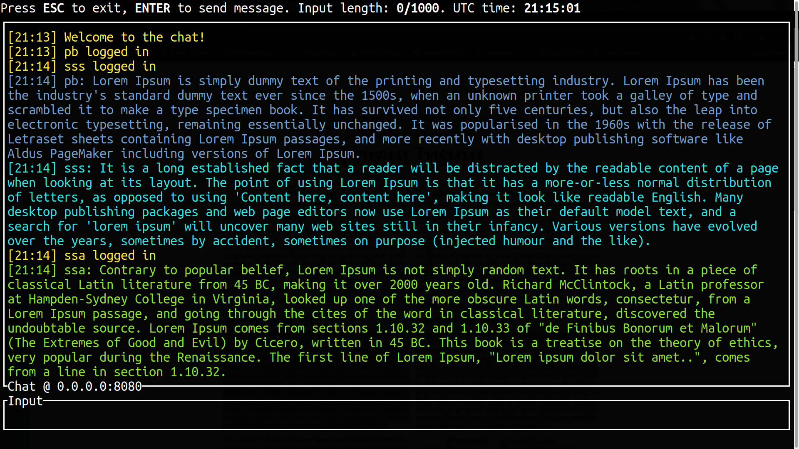

### RustChat

A **really simple** (don't even try to use UTF-8) TCP chat application written in everyone's favorite language - Rust! 🎉

#### Getting Started
1. Clone this repository:
   ```bash
   git clone https://github.com/pbialekk/rustchat.git
   ```
2. Navigate to the project directory:
    ```bash
    cd rustchat
    ```
3. Build and run the server:
    ```bash
    cargo run --release -p chat_server
    ```
4. Open a new terminal window and connect to the server:
    ```bash
    cargo run --release -p chat_client [serv_ip] [serv_port]
    ```

